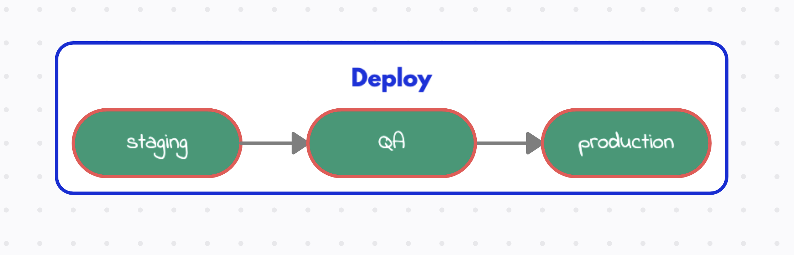

# Описание схемы настройки CD

staging — развёртывание приложения для разработчиков, DevOps, тестировщиков; \

Quality Assurance (QA) - автоматизированное тестирование, (для QA важно также обеспечить соблюдение стандартов и предотвратить появление ошибок и багов в ПО) \

production — развёртывание на production
